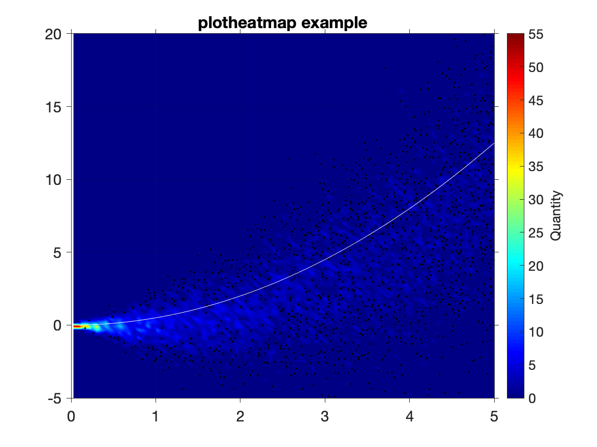

This is a MATLAB-based 2D histogram generation function (C.R. Densmore, Oct 2021).

`plotheatmap` bins and plots data as a 2D histogram on a 2D graph, where color corresponds to the number of points in each 2D bin. Outliers
(points whose bins have few enough elements to not appear on the plot, dependent on the color map and range) are scattered over the color contours.

Usage:
`plotheatmap(ax,xdata,ydata,xedges,yedges,cmap)` 
* ax: axes to plot into (e.g. `ax = gca`)
* xdata,ydata: data whose quantity is being plotted
* xedges,yedges: edges for the bins used in the 2D histogram
* cmap: colormap to use (e.g. `cmap = jet(100);`)

An usage example is included in `example.m` and generates the plot `example.png`:

